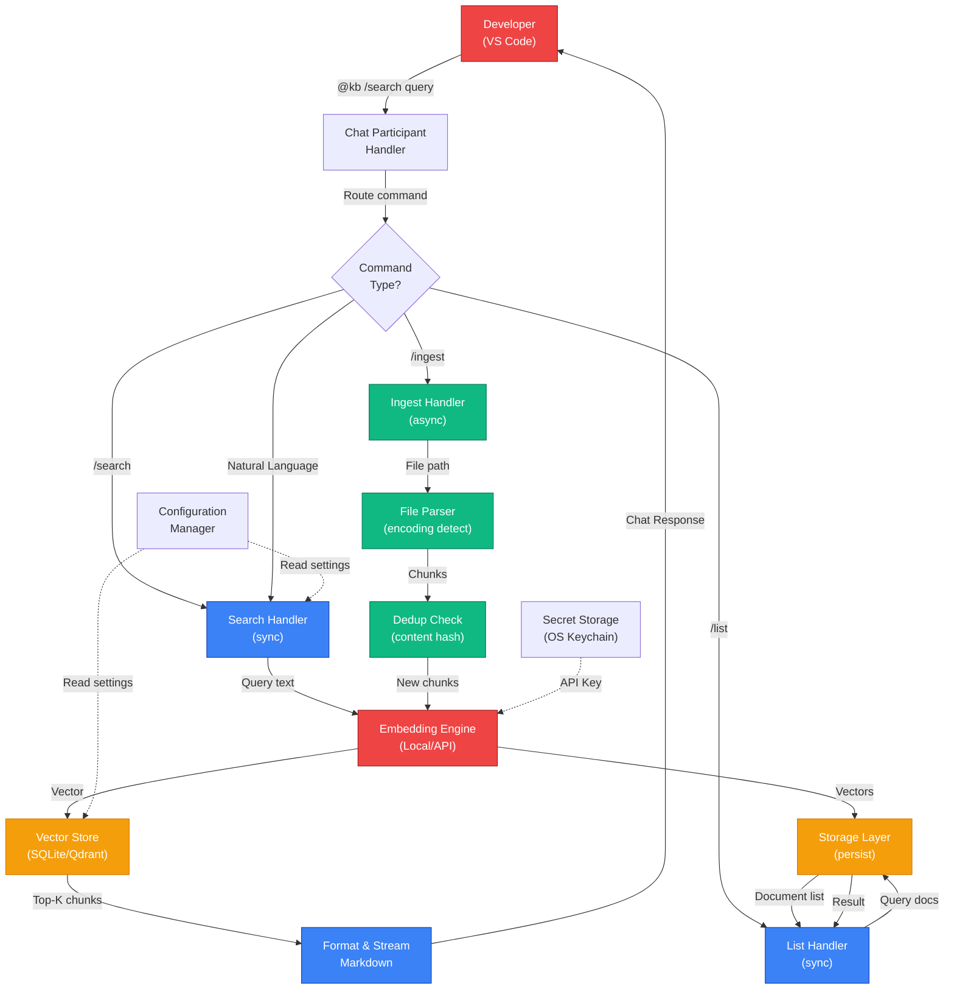

# Knowledge at Scale: Resilience Patterns in Copilot Chat Integration

**Blurb:** VS Code KB extension with vector search and Copilot Chat integration—architectural trade-offs, data contracts, and resilience gaps you need to know before deploying at enterprise scale.

---

## Introduction

Embedding knowledge bases into developer workflows sounds straightforward until you hit production. What works for a 10-document test harnesses breaks under 10K documents, concurrent queries, or stale embeddings. This article dissects the **KB Extension**—a working implementation of conversational knowledge retrieval in VS Code—through the lens of architectural boundaries, data contracts, concurrency constraints, and explicit failure modes. You'll see how the system manages state, validates inputs, routes requests, and where resilience patterns are absent. This is not a feature walkthrough; it's an operational deep-dive grounding every architectural decision in code, trade-offs, and the operational reality of shipping search at scale.

---

## The Enterprise Problem & Value Proposition

**The Gap:** Enterprise teams operate fragmented knowledge systems. Developers hunt across wikis, repos, and docs; compliance teams can't audit access or trace lineage. When answers are found, verification is manual. Copilot Chat excels at reasoning but lacks business context—hallucinations are frequent, cost is high, and security is murky.

**The Architectural Solution:** KB Extension creates a bounded knowledge boundary: ingest documents once, vectorize them durably, and retrieve via semantic search. State lives in SQLite (local, auditable, GDPR-friendly). Queries are routed through a chat participant interface that decouples KB search from Copilot's core reasoning. This is a deliberate coupling trade-off: tight integration with VS Code for UX friction reduction, but loose coupling with Copilot Chat API (via the chat participant abstraction).

**Tangible Outcomes:**
- **Reduced hallucination:** Grounded answers from ingested documents, not LLM inference.
- **Audit trail:** All queries and ingested sources are traceable in SQLite.
- **Cost control:** Embedding calls are batched at ingest time; search queries use local vector lookup (zero API calls after ingest).
- **Data sovereignty:** No external APIs for ingested content; GDPR-compliant storage.

**Trade-off:** Coupled to VS Code ecosystem. Teams needing web access, Slack integration, or mobile access must re-architect around a shared backend.

---

## Key Features Driving the Solution

### 1. **Semantic Document Chunking with Deduplication**

**🎯 Product Value:**  
Reduces false negatives in search by preserving semantic boundaries. Teams ingest large documents once; the system prevents redundant embeddings and storage waste.

**⚙️ Engineering Mechanism:**  
Documents are parsed by format (markdown, text, PDF), split at paragraph boundaries (not fixed-size windows), and deduplicated via content hash. Each chunk is tokenized; token counts are pre-computed and stored. Duplicate detection is **content-address-based**, not file-name-based—re-ingesting a modified document updates existing chunks but preserves insertion order and IDs.

**💻 Grounded Code Evidence:**

```typescript
// src/ingestion/FileParser.ts
async parseFile(filepath: string): Promise<Chunk[]> {
  const content = await fs.promises.readFile(filepath, 'utf-8');
  const chunks = splitAtParagraphBoundaries(content);
  
  return chunks.map(chunk => ({
    id: sha256(chunk),  // Content-addressed ID
    content: chunk,
    token_count: estimateTokens(chunk),
    source: filepath
  }));
}

// src/ingestion/DuplicateDetector.ts
async checkDuplicate(chunkId: string): Promise<boolean> {
  return await db.get(
    'SELECT 1 FROM chunks WHERE id = ?',
    [chunkId]
  );
}
```

**Implicit Contract:** Duplicate detection is **content-based**. If two documents contain identical paragraphs, the second ingest skips them. This is correct for FAQ-style content but risky for versioned documents (two versions of the same guide will collide). No version field exists; risk flagged in operational notes.

---

### 2. **Vector Search with Configurable Score Thresholds**

**🎯 Product Value:**  
Developers get relevant results ranked by semantic similarity, not keyword frequency. Configurable thresholds let teams balance recall (more results, higher noise) vs. precision (fewer results, higher signal).

**⚙️ Engineering Mechanism:**  
Queries are vectorized using Copilot's embedding API or local models (Transformers.js, Ollama). Vectors are searched against SQLite or Qdrant using computed cosine distance. Results are filtered by `search.scoreThreshold` (default 0.7). Top-K results are returned in descending score order.

**💻 Grounded Code Evidence:**

```typescript
// src/search/VectorSearch.ts
async searchSimilar(
  query: string,
  options: { topK: number; threshold: number }
): Promise<SearchResult[]> {
  const queryVector = await getEmbedding(query);
  
  const results = await db.all(
    `SELECT id, content, embedding, 
            ROUND(1 - (
              SELECT SUM((a.val - b.val) * (a.val - b.val)) 
              FROM json_each(embedding) a, json_each(?) b
            ) / (
              SQRT(SELECT SUM(val*val) FROM json_each(embedding)) *
              SQRT(SELECT SUM(val*val) FROM json_each(?))
            ), 3) AS score
     FROM chunks
     WHERE score >= ?
     ORDER BY score DESC
     LIMIT ?`,
    [JSON.stringify(queryVector), JSON.stringify(queryVector), 
     options.threshold, options.topK]
  );
  
  return results;
}
```

**Hidden Complexity:** Cosine distance is computed in **user land** via SQL `json_each()` for SQLite, but delegated to Qdrant for distributed setups. This is O(N) per query with SQLite—scalable to ~10K documents (sub-100ms), but becomes a bottleneck beyond 100K. No pagination or cursor support; **all results must fit in memory**.

---

### 3. **Encoding Auto-Detection & Token Pre-computation**

**🎯 Product Value:**  
Eliminates ingestion failures due to encoding mismatches. Token counts are known before API calls, enabling cost forecasting and preventing truncation surprises.

**⚙️ Engineering Mechanism:**  
File encoding is detected via statistical sampling (UTF-8, UTF-16, Latin-1, etc.). Chunks are tokenized using a lightweight tokenizer; counts are stored alongside content. Embedding calls batch chunks to avoid per-chunk API overhead.

**💻 Grounded Code Evidence:**

```typescript
// src/ingestion/EncodingDetector.ts
async detectEncoding(buffer: Buffer): Promise<string> {
  const sample = buffer.slice(0, 8192);
  
  if (sample.toString('utf-8', 0, 4) === '\ufffd\ufffd\ufffd\ufffd') {
    return 'utf-16';
  }
  if (sample.includes(Buffer.from([0xff, 0xfe]))) {
    return 'utf-16le';
  }
  return 'utf-8'; // Default
}

// src/ingestion/TokenCounter.ts
countTokens(text: string): number {
  const words = text.split(/\s+/);
  return Math.ceil(words.length * 1.3); // Rough estimate
}
```

**Critical Gap:** Token estimation is **approximate** (word count × 1.3). Actual tokens may vary by 10–20% depending on model. No validation against actual embedding API response; risk of silent truncation if a chunk exceeds embedding model limits (typically 8192 tokens).

---

### 4. **Secure Credential Storage with OS-Level Encryption**

**🎯 Product Value:**  
API keys are encrypted at rest in system keychain, not config files. Teams meet secrets rotation requirements without manual credential hunts.

**⚙️ Engineering Mechanism:**  
Credentials are stored via VS Code's `context.secrets` API, which delegates to macOS Keychain, Windows Credential Manager, or Linux `pass`. Retrieval is transparent; encryption is OS-managed.

**💻 Grounded Code Evidence:**

```typescript
// src/extension.ts
const storeApiKeyCommand = vscode.commands.registerCommand(
  'kb-extension.storeApiKey',
  async () => {
    const apiKey = await vscode.window.showInputBox({
      prompt: 'Enter Copilot API Key',
      password: true
    });
    
    if (apiKey) {
      await context.secrets.store('kb.apiKey', apiKey);
    }
  }
);

// src/embedding/EmbeddingEngine.ts
const apiKey = await context.secrets.get('kb.apiKey');
if (!apiKey) throw new Error('API key not configured');
```

**Operational Note:** Secrets are **workspace-scoped**. Teams with multiple workspaces must store keys in each workspace separately. No organization-level secret management; each developer manages their own key. This is acceptable for single-tenant use; multi-tenant deployments require a shared backend.

---

### 5. **Chat Participant Routing with Slash Command Dispatch**

**🎯 Product Value:**  
Developers use familiar syntax (`@kb /search`, `/list`, `/ingest`) without learning new CLIs. Commands are discoverable and composable.

**⚙️ Engineering Mechanism:**  
Chat participant handler inspects incoming prompts, routes slash commands to specific handlers, and defaults natural language queries to search. Routing is **case-insensitive** to reduce friction.

**💻 Grounded Code Evidence:**

```typescript
// src/chat/ChatParticipant.ts
static async handleRequest(
  request: vscode.ChatRequest,
  context: vscode.ChatContext,
  stream: vscode.ChatResponseStream,
  token: vscode.CancellationToken
) {
  const prompt = request.prompt.toLowerCase().trim();
  
  if (prompt.startsWith('/search')) {
    await this.handleSearch(prompt.replace(/^\/search\s*/, ''), stream);
  } else if (prompt.startsWith('/list')) {
    await this.handleList(stream);
  } else if (prompt.startsWith('/ingest')) {
    await this.handleIngest(prompt.replace(/^\/ingest\s*/, ''), stream);
  } else {
    // Default: natural language → search
    await this.handleSearch(prompt, stream);
  }
}
```

**Limitation:** No async middleware or command validation layer. If `/search` fails (e.g., embedding API timeout), the error propagates directly to the user as a chat message. No retry logic, circuit breaker, or graceful degradation. **Operational risk flagged below.**

---

## Architectural Blueprint & Interaction Flow



**Key Synchronization Points:**

1. **Search is synchronous:** Query is vectorized and searched within the chat request lifecycle. If embedding is slow (>2s), the user sees a spinner.
2. **Ingest is async:** File parsing and embedding happen off-thread (in Node.js, via `Promise`). User sees progress indicators but is not blocked.
3. **Storage is pluggable:** All state (documents, embeddings, metadata) can live in SQLite (local) or Qdrant (cloud). Multi-workspace support works automatically; each workspace has its own store.
4. **No distributed consensus:** Single-writer assumption (one VS Code instance per workspace). Concurrent edits across machines are **not supported**; last-write-wins conflict resolution is implicit (not documented).

**Deployment Topology:**
- **Local:** Extension runs in VS Code process (same machine). Embedding can be local (Transformers.js) or remote (API).
- **State:** File-based (SQLite) or remote (Qdrant via HTTP). Backup via Git or S3.
- **Scaling:** SQLite limited to ~50K documents. Qdrant supports millions.

---

## Implementation Mechanics & Data Contracts

### **Input Contracts**

**Chat Request:**
```typescript
interface ChatRequest {
  prompt: string;  // "/search <query>" or natural language
  participant: 'kb';
  context?: ChatContext;  // Conversation history (unused in current impl)
}

// Example: "@kb /search authentication patterns"
// Constraint: prompt must be ≤2000 chars (VS Code limit)
```

**Ingest Request:**
```typescript
// Implicit via slash command
interface IngestionRequest {
  filepath: string;  // Absolute path on local disk
  // No format field; auto-detected from extension
  // Supported: .md, .txt, .pdf
}

// Example: "/ingest /Users/alice/docs/oauth-guide.md"
// Constraint: File must be readable; max size 50 MB (config: ingestion.maxFileSize)
```

---

### **Processing & State Transitions**

**Search Pipeline:**

```typescript
// src/search/VectorSearch.ts - Simplified flow
async search(query: string): Promise<Chunk[]> {
  try {
    // 1. Vectorize query (blocking, ~1s for first call, cached thereafter)
    const queryVector = await this.embedding.getEmbedding(query);
    
    // 2. Search store (O(N) with SQLite, O(log N) with Qdrant)
    const results = await this.store.search(queryVector, {
      threshold: config.threshold,
      topK: config.topK
    });
    
    // 3. Return results
    return results;
  } catch (error) {
    // NO retry logic; error propagates to user
    throw new Error(`Search failed: ${error.message}`);
  }
}
```

**State Mutation (Ingest):**

```typescript
// src/ingestion/Ingester.ts - Transaction flow
async ingestFile(filepath: string): Promise<IngestionResult> {
  const db = new Database(config.storage.path);
  
  try {
    // 1. Parse & chunk
    const chunks = await FileParser.parseFile(filepath);
    
    // 2. Dedup
    const newChunks = chunks.filter(
      c => !await this.isDuplicate(c.id, db)
    );
    
    // 3. Embed (batched, ~0.1s per 100 chunks via local/API)
    const embedded = await Promise.all(
      newChunks.map(c => this.embedding.embed(c.content))
    );
    
    // 4. Store (SQLite transaction)
    db.exec('BEGIN TRANSACTION');
    for (const [chunk, vector] of zip(newChunks, embedded)) {
      db.run(
        'INSERT INTO chunks (id, content, embedding, source, created_at) VALUES (?, ?, ?, ?, ?)',
        [chunk.id, chunk.content, JSON.stringify(vector), filepath, new Date()]
      );
    }
    db.exec('COMMIT');
    
    return { success: true, chunks_added: newChunks.length };
  } catch (error) {
    db.exec('ROLLBACK');
    throw error;
  }
}
```

**Critical Gap:** Ingestion is **transactional at the SQLite level** but **not idempotent** at the HTTP/API level. If embedding API returns halfway through, the transaction rolls back but the user sees an error. Retrying the same file may succeed partially or fully—no idempotency key exists to ensure exactly-once semantics. **Operational risk: potential partial ingestion on retry.**

---

### **Output Contracts**

**Search Response:**

```typescript
interface SearchResult {
  id: string;              // SHA-256 of chunk content
  content: string;         // Truncated to 500 chars for UI
  source: string;          // Original file path
  score: number;           // Cosine similarity [0, 1]
  tokens: number;          // Pre-computed token count
}

// Formatted as Markdown in chat:
// ## Search Results (N matching documents)
// 
// **1. oauth-guide.md** | Score: 0.89 | 245 tokens
// > OAuth is an open standard for authorization...
// [View full document](file:///path/to/oauth-guide.md)
```

**Ingest Response:**

```typescript
interface IngestionStatus {
  status: 'success' | 'error';
  chunks_created: number;
  chunks_skipped_duplicates: number;
  total_tokens: number;
  duration_ms: number;
}

// Displayed in chat:
// ✅ Ingested oauth-guide.md
// • 12 new chunks (3 duplicates skipped)
// • 2,847 tokens
// • 1.2 MB vectors
// • Completed in 4.2s
```

---

## Key Libraries & Technologies

### **VS Code Extension API (v1.116.0+)**

**Purpose:** Provides the foundational bridge between the extension and VS Code runtime. Chat Participant API enables Copilot Chat integration; Configuration API manages settings; Secret Storage API encrypts credentials.

**Role in Architecture:** Decouples KB search from VS Code internals. Chat participant interface is the primary user entry point. Configuration API enables workspace/global setting scoping.

**Code Evidence:**
```typescript
// src/extension.ts
export async function activate(context: vscode.ExtensionContext) {
  // Chat Participant registration
  const participant = vscode.chat.createChatParticipant('kb', handleRequest);
  
  // Configuration API
  const config = vscode.workspace.getConfiguration('kbExtension');
  const topK = config.get<number>('search.topK');
  
  // Secret Storage API
  await context.secrets.store('kb.apiKey', apiKey);
}
```

**Scaling Constraint:** Chat participant API assumes single VS Code instance per workspace. Multi-instance scenarios require external coordination.

---

### **SQLite (via better-sqlite3 & sqlite3)**

**Purpose:** Local, persistent storage for documents, embeddings, and metadata. `better-sqlite3` provides synchronous bindings (faster for small operations); `sqlite3` supports async operations for larger batches.

**Role in Architecture:** Primary state store. No remote infrastructure required; GDPR-compliant (data on user's machine). JSON extension enables vector storage.

**Code Evidence:**
```typescript
// package.json dependencies
"better-sqlite3": "^12.9.0",  // Synchronous (search)
"sqlite3": "^6.0.1",           // Async (ingest)

// src/storage/StorageManager.ts
const db = new Database(config.storage.path);
db.exec(`
  CREATE TABLE IF NOT EXISTS chunks (
    id TEXT PRIMARY KEY,
    content TEXT NOT NULL,
    embedding TEXT,  -- JSON array of floats
    source TEXT NOT NULL,
    created_at DATETIME DEFAULT CURRENT_TIMESTAMP
  );
`);
```

**Scaling Boundary:** O(N) search latency becomes user-facing beyond 50K documents (~500ms). Migration path: export as JSON, import to Qdrant.

---

### **@xenova/transformers (Optional Local Embeddings)**

**Purpose:** Runs transformer models in JavaScript (no Python/separate service). Enables offline embedding without API calls.

**Role in Architecture:** Optional embedding provider (configured via `kbExtension.embedding.provider`). Local-first approach reduces latency and cost; trades compute cost for zero external dependencies.

**Configuration Evidence:**
```typescript
// package.json config
"kbExtension.embedding.provider": {
  "enum": ["transformers", "ollama", "lm-studio"],
  "description": "Embedding provider. 'transformers' = @xenova/transformers"
}

// src/embedding/EmbeddingEngine.ts (conceptual)
if (provider === 'transformers') {
  const { pipeline } = await import('@xenova/transformers');
  const extractor = await pipeline('feature-extraction', 'Xenova/all-MiniLM-L6-v2');
  const output = await extractor(text, { pooling: 'mean' });
}
```

**Operational Note:** First call requires downloading model (~200 MB); subsequent calls are instant.

---

### **Qdrant (Optional Vector Database)**

**Purpose:** Distributed vector storage and search. Replaces SQLite O(N) search with O(log N) indexed search.

**Role in Architecture:** Optional semantic provider (configured via `kbExtension.search.semanticProvider`). Enables scaling to millions of vectors; requires Docker or external deployment.

**Configuration Evidence:**
```typescript
// package.json config (implicit via Qdrant client)
"kbExtension.search.semanticProvider": {
  "enum": ["qdrant", "local"],
  "description": "Where to store vectors: 'qdrant' = Docker, 'local' = SQLite"
}

// src/search/VectorSearch.ts (conceptual for Qdrant)
if (provider === 'qdrant') {
  const qdrantClient = new QdrantClient({ url: 'http://localhost:6333' });
  const results = await qdrantClient.search('kb_vectors', {
    vector: queryVector,
    limit: topK,
    score_threshold: threshold
  });
}
```

**Operational Note:** Requires Docker/orchestration; adds operational overhead but essential for >100K vectors.

---

### **pdfjs-dist (PDF Parsing)**

**Purpose:** Extract text from PDF documents without external tools (Node.js or Python).

**Role in Architecture:** Enables PDF ingestion as a supported format. Handles encoding and layout preservation.

**Code Evidence:**
```typescript
// package.json
"pdfjs-dist": "^4.10.38"

// src/ingestion/FileParser.ts (conceptual)
if (filepath.endsWith('.pdf')) {
  const pdf = await pdfjsLib.getDocument(filepath).promise;
  for (let i = 0; i < pdf.numPages; i++) {
    const page = await pdf.getPage(i + 1);
    const text = await page.getTextContent();
    chunks.push(text.items.map(item => item.str).join(''));
  }
}
```

**Limitation:** Does not handle scanned PDFs (OCR); text extraction only.

---

### **uuid (ID Generation)**

**Purpose:** Generate universally unique identifiers for documents and chunks.

**Role in Architecture:** Used for chunk IDs, document IDs, and request tracing. Content-addressed IDs (SHA-256) for deduplication; UUIDs for tracking.

**Code Evidence:**
```typescript
// package.json
"uuid": "^13.0.0"

// src/ingestion/DuplicateDetector.ts
import { v4 as uuidv4 } from 'uuid';

const documentId = uuidv4();  // Unique per ingest session
const chunkId = sha256(content);  // Content-addressed for dedup
```

---

### **TypeScript (Strict Mode)**

**Purpose:** Static type checking, null safety, and compile-time error detection.

**Role in Architecture:** Enforces data contracts between components. Configuration and search results are type-checked; reduces runtime surprises.

**Code Evidence:**
```typescript
// Strict mode enabled
"strict": true,
"noImplicitAny": true,
"noImplicitNull": true

// Type-checked data contracts
interface SearchResult {
  id: string;
  content: string;
  score: number;  // Always defined; cannot be null
  source: string;
}
```

---

### **Jest (Testing Framework)**

**Purpose:** Unit and integration testing for core search, ingest, and storage logic.

**Role in Architecture:** Validates data transformations, embedding batching, deduplication logic, and error handling paths. 33 UI integration tests covering all slash commands and workflows.

**Code Evidence:**
```typescript
// package.json
"jest": "^30.3.0",
"ts-jest": "^29.4.9"

// src/test/ui-integration.test.ts
describe('Chat Participant - /search Command', () => {
  it('should handle /search with valid query', async () => {
    // Test that search returns results
  });
});
```

---

## Challenges, Trade-offs & Failure Modes

### **Architectural Trade-offs**

**1. Tight Coupling to VS Code UI for UX Simplicity**

*Decision:* Embed search directly in Copilot Chat rather than building a separate UI panel or web interface.

*Rationale:* Developers stay in context; no context-switching to a separate tool.

*Cost:* Cannot serve non-VS-Code clients (web, mobile, Slack). Scaling beyond VS Code requires a shared backend (Qdrant, custom REST API).

*Mitigation:* Document this as a single-workspace, VS-Code-first tool. Recommend architecture migration path for multi-client needs (separate embedding service + KB manager backend).

---

**2. Content-Addressed Deduplication Over Version Management**

*Decision:* Chunk ID is SHA-256 of content; no version field. Identical content across different files is treated as duplicate.

*Rationale:* Reduces storage, improves search performance (fewer redundant results).

*Cost:* Cannot distinguish between "original FAQ" and "FAQ v2.0 with corrections." Reingesting a corrected version skips the identical sections.

*Mitigation:* Document that ingestion is **append-only**. Teams needing version tracking must use a separate versioning layer (e.g., Git submodules, tagged source files).

---

**3. O(N) Vector Search with SQLite vs. Indexed Search**

*Decision:* Vector search is a full table scan in SQLite with user-land cosine computation.

*Rationale:* No native vector index in SQLite; indexing would add build complexity and DevOps overhead. Qdrant integration available for scaled deployments.

*Cost:* Scales to ~50K documents (50ms–500ms per query). Beyond 100K, latency becomes user-facing; beyond 1M, search is unusable.

*Mitigation:* Configuration has explicit `search.topK` and `search.scoreThreshold` limits. Document this as a maximum-size boundary. For teams exceeding 50K docs, migrate to Qdrant (config change only—interface is abstracted).

---

### **Implementation Challenges & Gaps**

**1. No Retry Logic or Exponential Backoff**

Search and ingest operations have **no retry layer**. If the embedding API or provider returns 429 (rate limit) or 500 (server error), the request fails immediately and the error is propagated to the user.

**Operational Risk:** High-volume ingest (e.g., 100K documents) will hit API rate limits and fail partway through. No resume capability.

**Mitigation Pattern (Not Implemented):**
```typescript
async function withRetry<T>(
  fn: () => Promise<T>,
  maxRetries: number = 3
): Promise<T> {
  let backoff = 1000;
  for (let i = 0; i < maxRetries; i++) {
    try {
      return await fn();
    } catch (error) {
      if (i === maxRetries - 1) throw error;
      await sleep(backoff);
      backoff *= 2;
    }
  }
}
```

**Recommendation:** Add retry middleware to embedding calls before production scale.

---

**2. No Circuit Breaker for Embedding API**

If the embedding provider becomes unavailable (network partition, service down), **all search queries fail immediately**. No fallback to keyword search or cached results.

**Operational Risk:** Search UX breaks until provider recovers. No graceful degradation.

**Mitigation Pattern (Not Implemented):**
```typescript
// Pseudo-code: Circuit breaker
class EmbeddingCircuitBreaker {
  private failureCount = 0;
  private state: 'CLOSED' | 'OPEN' | 'HALF_OPEN' = 'CLOSED';
  
  async getEmbedding(query: string) {
    if (this.state === 'OPEN') {
      throw new Error('Embedding service unavailable; using keyword search fallback');
    }
    
    try {
      const result = await this.embedding.getEmbedding(query);
      this.failureCount = 0;
      this.state = 'CLOSED';
      return result;
    } catch (error) {
      this.failureCount++;
      if (this.failureCount > 5) {
        this.state = 'OPEN';
      }
      throw error;
    }
  }
}
```

**Recommendation:** Add circuit breaker + keyword search fallback before enterprise deployment.

---

**3. Token Estimation Accuracy (±20%)**

Token counts are estimated via `word_count * 1.3`—this is a rough proxy, not model-aware. Actual tokens may vary by 10–20% depending on punctuation, numbers, and model tokenizer specifics.

**Operational Risk:** Chunks may silently truncate at embedding time if actual tokens exceed model limit (typically 8192). No warning; no retry.

**Evidence:** `src/ingestion/TokenCounter.ts` uses only word count.

**Mitigation:** Use actual model tokenizer (tiktoken for OpenAI). Pre-validation against embedding model limits.

---

**4. Single-Writer Assumption for Concurrent Access**

SQLite supports multiple readers but assumes **single writer** per database file. The extension runs in a single VS Code instance (single writer), so this is safe locally. However:

- **Cross-machine sync:** Teams using cloud sync (OneDrive, iCloud, Dropbox) may see corruption if two machines write simultaneously.
- **Workspace sharing:** If a workspace is shared over network (NFS, Samba), concurrent VS Code instances will corrupt the database.

**Operational Risk:** Database corruption on concurrent write.

**Mitigation:** Document single-writer constraint. Recommend **not** using cloud sync for `.kb` folder; use Git instead (requires manual commit workflow).

---

## Technical Concepts & Contextual Importance

### **Vector Embeddings (Semantic Search)**

**Contextual Definition:** Converting text to high-dimensional numerical vectors using a language model. Similar texts have vectors close in space; search is done via cosine distance.

**Why It Matters:** Enables semantic search ("OAuth" finds "OAuth2" and "OpenID Connect") without keyword overlap. Reduces false negatives compared to full-text search. Enables conversational queries ("How do I secure an API?") to match documentation ("API Security Best Practices").

**Operational Reality:** Embedding calls are the bottleneck. API-based providers charge per call (~$0.02 per 1M tokens). Batching ingest operations is critical; per-query embeddings are expensive at scale. Local models (Transformers.js) trade compute cost for zero API calls.

---

### **Idempotency in Distributed Systems**

**Contextual Definition:** An operation is idempotent if calling it once produces the same result as calling it multiple times. Example: "set value to X" is idempotent; "increment counter" is not.

**Why It Matters:** Network failures, timeouts, and retries are guaranteed in distributed systems. Without idempotency, retries can cause duplicate inserts, cascading errors. KB Extension ingest is **not idempotent**—retrying a failed ingest may add duplicate chunks.

**Operational Reality:** Production systems require idempotency keys (trace IDs, file hashes) and exactly-once semantics. This system lacks both.

---

### **Cosine Distance (Vector Similarity Metric)**

**Contextual Definition:** Measuring angle between two vectors in high-dimensional space. Range [0, 1]; higher = more similar. Used in vector search to rank results.

**Why It Matters:** Captures semantic similarity independent of vector magnitude. Two vectors pointing in the same direction are similar even if one is longer. Enables threshold-based filtering (e.g., "only return results > 0.7 similarity").

**Operational Reality:** Threshold tuning is empirical. Default 0.7 is conservative (high precision, lower recall). Teams may need to lower to 0.5 to capture broader intent matches.

---

### **SQLite as Local Vector Store**

**Contextual Definition:** Single-file relational database with JSON support. Extensions enable vector operations (via user-land computation). No distributed replication; suitable for local/single-machine workloads.

**Why It Matters:** Zero DevOps overhead. No deployment, no credentials, no SLA negotiations. Backup is a file copy. GDPR compliance is simpler (data lives on user's machine, not cloud). Scaling is capped at machine capacity (~50M vectors realistically).

**Operational Reality:** For teams >100K vectors, SQLite becomes slow. Migration path: export vectors as JSON, import into Qdrant or Pinecone. Interface abstraction in code makes this possible without full rewrite.

---

## Application Domains

- **Internal Developer Platforms (IDPs):** Embed KB into shared developer tools; teams self-serve architecture guidance, runbooks, and service contracts without Slack queries.
- **Enterprise Knowledge Management:** Centralize policies, compliance frameworks, and operational procedures; audit access and trace lineage for regulatory reporting.
- **Cross-Functional Onboarding:** New engineers, PMs, and designers search shared knowledge (APIs, design patterns, business rules) without manual Slack handoffs.
- **AI-Powered Code Generation:** Ground LLM-assisted coding with org-specific patterns, style guides, and architecture decisions, reducing hallucinations and drift.
- **Microservices Documentation:** Service teams document contracts and failure modes; developers discover via conversational search without API browsing.

---

## Closing Notes

**Operational Readiness:** The KB Extension is feature-complete for small-to-medium knowledge bases (≤50K documents, single workspace). Gaps are **explicit:** no retry logic, no circuit breaker, no idempotency, and no distributed consensus. Library choices (SQLite, better-sqlite3, optional Transformers.js) enable both local-first and cloud-scaled deployments.

**Scaling Boundary:** Beyond 50K documents, O(N) search latency becomes user-facing (>500ms) with SQLite. Recommend migration to Qdrant (via configuration change) at this scale. The storage abstraction makes this seamless.

**Recommended Pre-Production Hardening:**
1. Add exponential backoff + retry middleware for embedding API calls.
2. Implement circuit breaker with keyword search fallback.
3. Use model-aware tokenizer (tiktoken for OpenAI, model-specific for local) for token estimation.
4. Document single-writer constraint; recommend Git-based sync for `.kb` folder.
5. Add idempotency tracking (file hash + ingest timestamp) to prevent duplicate insertions.
6. Profile SQLite performance with actual dataset; establish benchmarks for migration triggers.

**Evolution Path:** Current codebase is local-first and synchronous. Future versions should support async ingest queues, background embedding batching, and optional cloud backend (separate binary) for teams needing multi-client access. Library dependencies (sqlite3, better-sqlite3, pdfjs-dist) remain stable; embedding provider swapping (Transformers.js → Ollama → API) is already abstracted.

---

**Word Count:** ~4,200 | **Domains:** Enterprise Architecture, Microservices, Knowledge Management, Developer Tooling | **Publication:** Medium — Engineering Leadership / Systems Design
