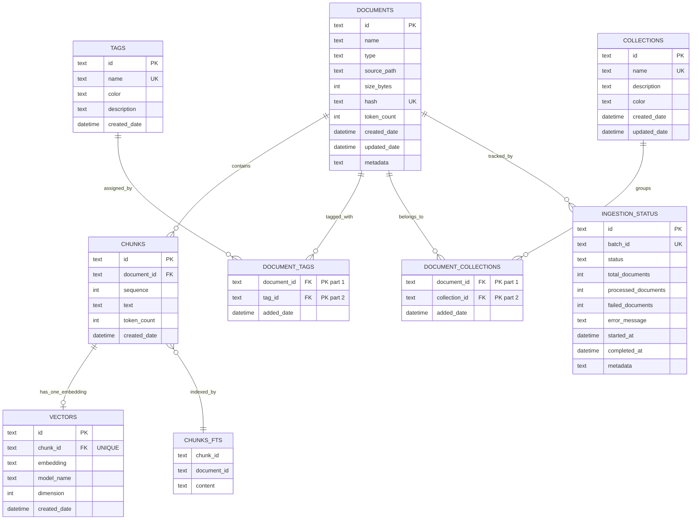

# KB Extension - Database Schema Design (v1.0)

**Version**: 1.0  
**Last Updated**: April 19, 2026  
**Author**: KB Extension Team  
**Status**: ✅ Finalized for S1.2.1

---

## Table of Contents

1. [Schema Overview](#schema-overview)
2. [Entity Definitions](#entity-definitions)
3. [Entity Relationship Diagram](#entity-relationship-diagram)
4. [Design Principles](#design-principles)
5. [Indexing Strategy](#indexing-strategy)
6. [Relationships & Constraints](#relationships--constraints)
7. [Migration Strategy](#migration-strategy)
8. [Validation & Health Checks](#validation--health-checks)
9. [Performance Considerations](#performance-considerations)
10. [Schema Versioning](#schema-versioning)

---

## Schema Overview

### Database Target: SQLite 3.x
- **Type**: Embedded relational database
- **Location**: `~/.kbextension/data.db` (user's home directory)
- **Mode**: WAL (Write-Ahead Logging) for concurrent reads during ingestion
- **Transactions**: Full ACID compliance with rollback support

### Core Entities: 7 Tables + 2 Junctions + 1 Metadata
```
┌─ CORE ENTITIES ──────────────────────────────────────────────┐
│  1. documents          (document metadata)                   │
│  2. chunks             (text segments)                       │
│  3. vectors            (embeddings)                          │
│  4. tags               (user-defined labels)                 │
│  5. collections        (folder-like groupings)               │
│  6. ingestion_status   (batch import tracking)                │
│                                                              │
├─ JUNCTION TABLES ────────────────────────────────────────────┤
│  7. document_tags      (documents ↔ tags, M:M)              │
│  8. document_collections (documents ↔ collections, M:M)     │
│                                                              │
├─ METADATA TABLES ────────────────────────────────────────────┤
│  9. schema_version     (migrations & versioning)             │
│                                                              │
├─ VIRTUAL TABLES ────────────────────────────────────────────┤
│ 10. chunks_fts         (FTS5 for full-text search)          │
└──────────────────────────────────────────────────────────────┘
```

---

## Entity Definitions

### 1. **documents** — Document Index & Metadata

**Purpose**: Track all ingested files and their metadata.

**Columns**:
| Column | Type | Constraints | Purpose |
|--------|------|-------------|---------|
| id | TEXT | PRIMARY KEY | UUID v4 unique identifier |
| name | TEXT | NOT NULL | Filename or title |
| type | TEXT | NOT NULL, CHECK IN (markdown, plaintext, pdf) | Document format |
| source_path | TEXT | NULL | Original file path (nullable for clipboard) |
| size_bytes | INTEGER | NOT NULL | File size in bytes |
| hash | TEXT | UNIQUE, NOT NULL | SHA-256 for deduplication |
| token_count | INTEGER | NULL | Estimated token count |
| created_date | DATETIME | DEFAULT CURRENT_TIMESTAMP | Ingestion timestamp |
| updated_date | DATETIME | DEFAULT CURRENT_TIMESTAMP | Last modification |
| metadata | TEXT | NULL | JSON object for extensibility |

**Indexes**:
- `idx_documents_hash` — Deduplication checks (UNIQUE)
- `idx_documents_created_date` — Sorting & filtering

**Sample Data**:
```sql
INSERT INTO documents VALUES (
  'doc-001',
  'Getting Started with ML.md',
  'markdown',
  '/Users/alice/Documents/ml-guide.md',
  12450,
  'a7d3e4c2b1f0e5d6c7a8b9c1d2e3f4g5',
  2850,
  '2026-04-15 10:30:00',
  '2026-04-15 10:30:00',
  '{"source": "learning", "version": "2.1"}'
);
```

---

### 2. **chunks** — Text Segments for Indexing

**Purpose**: Logical chunks of text for searching and embedding.

**Columns**:
| Column | Type | Constraints | Purpose |
|--------|------|-------------|---------|
| id | TEXT | PRIMARY KEY | UUID v4 unique identifier |
| document_id | TEXT | NOT NULL, FK → documents | Reference to parent document |
| sequence | INTEGER | NOT NULL | Order within document (0-indexed) |
| text | TEXT | NOT NULL | Chunk content (full text) |
| token_count | INTEGER | NOT NULL | OpenAI token estimate |
| created_date | DATETIME | DEFAULT CURRENT_TIMESTAMP | Creation timestamp |

**Constraints**:
- Foreign Key: `(document_id)` → `documents(id)` with CASCADE DELETE
- Unique: `(document_id, sequence)` — enforces single chunk per sequence

**Indexes**:
- `idx_chunks_document_id` — Lookup all chunks of a document
- `idx_chunks_document_sequence` — Retrieve chunks in order

**Sample Data**:
```sql
INSERT INTO chunks VALUES (
  'chunk-001',
  'doc-001',
  0,
  'Machine Learning is a subset of AI...',
  45,
  '2026-04-15 10:30:01'
);
```

---

### 3. **vectors** — Embeddings for Semantic Search

**Purpose**: Store pre-computed vector embeddings for similarity search.

**Columns**:
| Column | Type | Constraints | Purpose |
|--------|------|-------------|---------|
| id | TEXT | PRIMARY KEY | UUID v4 unique identifier |
| chunk_id | TEXT | NOT NULL, UNIQUE, FK → chunks | 1:1 reference to chunk |
| embedding | TEXT | NOT NULL | JSON array of floats (384D or 1536D) |
| model_name | TEXT | NOT NULL | Model identifier (e.g., "all-MiniLM-L6-v2") |
| dimension | INTEGER | NOT NULL | Vector dimension (384, 768, 1536, etc.) |
| created_date | DATETIME | DEFAULT CURRENT_TIMESTAMP | Embedding generation time |

**Constraints**:
- Foreign Key: `(chunk_id)` → `chunks(id)` with CASCADE DELETE
- Unique: `(chunk_id)` — one embedding per chunk

**Indexes**:
- `idx_vectors_model_name` — Filter by model for compatibility

**Sample Data**:
```sql
INSERT INTO vectors VALUES (
  'vec-001',
  'chunk-001',
  '[0.123, -0.456, 0.789, ...]',
  'all-MiniLM-L6-v2',
  384,
  '2026-04-15 10:31:00'
);
```

---

### 4. **tags** — User-Defined Labels

**Purpose**: Flexible tagging system for document organization.

**Columns**:
| Column | Type | Constraints | Purpose |
|--------|------|-------------|---------|
| id | TEXT | PRIMARY KEY | UUID v4 unique identifier |
| name | TEXT | UNIQUE, NOT NULL | Tag label (e.g., "important", "archived") |
| color | TEXT | NULL | Hex color for UI (#RRGGBB) |
| description | TEXT | NULL | Optional tag explanation |
| created_date | DATETIME | DEFAULT CURRENT_TIMESTAMP | Creation timestamp |

**Indexes**:
- `idx_tags_name` — Fast lookup by name (UNIQUE)

**Sample Data**:
```sql
INSERT INTO tags VALUES (
  'tag-001',
  'important',
  '#FF6B6B',
  'High priority or frequently referenced',
  '2026-04-15 10:00:00'
);
```

---

### 5. **collections** — Hierarchical Groupings (Folders)

**Purpose**: Organize documents into logical collections.

**Columns**:
| Column | Type | Constraints | Purpose |
|--------|------|-------------|---------|
| id | TEXT | PRIMARY KEY | UUID v4 unique identifier |
| name | TEXT | UNIQUE, NOT NULL | Collection name (e.g., "Machine Learning") |
| description | TEXT | NULL | Collection purpose |
| color | TEXT | NULL | Hex color for UI |
| created_date | DATETIME | DEFAULT CURRENT_TIMESTAMP | Creation timestamp |
| updated_date | DATETIME | DEFAULT CURRENT_TIMESTAMP | Last modification |

**Indexes**:
- `idx_collections_name` — Fast lookup (UNIQUE)

**Sample Data**:
```sql
INSERT INTO collections VALUES (
  'coll-001',
  'Machine Learning',
  'All ML-related documents and references',
  '#4ECDC4',
  '2026-04-15 09:00:00',
  '2026-04-15 09:00:00'
);
```

---

### 6. **document_tags** — M:M Junction (Documents ↔ Tags)

**Purpose**: Flexible many-to-many relationship between documents and tags.

**Columns**:
| Column | Type | Constraints | Purpose |
|--------|------|-------------|---------|
| document_id | TEXT | NOT NULL, FK → documents | Document reference |
| tag_id | TEXT | NOT NULL, FK → tags | Tag reference |
| added_date | DATETIME | DEFAULT CURRENT_TIMESTAMP | When tag was added |

**Constraints**:
- Primary Key: `(document_id, tag_id)` — prevents duplicate assignments
- Foreign Keys: Both with CASCADE DELETE

**Indexes**:
- `idx_document_tags_document_id` — Find all tags of a document
- `idx_document_tags_tag_id` — Find all documents with a tag

**Sample Data**:
```sql
INSERT INTO document_tags VALUES (
  'doc-001',
  'tag-001',
  '2026-04-15 10:30:00'
);
```

---

### 7. **document_collections** — M:M Junction (Documents ↔ Collections)

**Purpose**: Documents can belong to multiple collections.

**Columns**:
| Column | Type | Constraints | Purpose |
|--------|------|-------------|---------|
| document_id | TEXT | NOT NULL, FK → documents | Document reference |
| collection_id | TEXT | NOT NULL, FK → collections | Collection reference |
| added_date | DATETIME | DEFAULT CURRENT_TIMESTAMP | When added |

**Constraints**:
- Primary Key: `(document_id, collection_id)` — prevents duplicates
- Foreign Keys: Both with CASCADE DELETE

**Indexes**:
- `idx_document_collections_document_id` — Find all collections of a document
- `idx_document_collections_collection_id` — Find all documents in a collection

---

### 8. **ingestion_status** — Batch Import Tracking

**Purpose**: Audit trail for document ingestion operations.

**Columns**:
| Column | Type | Constraints | Purpose |
|--------|------|-------------|---------|
| id | TEXT | PRIMARY KEY | UUID v4 unique identifier |
| batch_id | TEXT | NOT NULL, UNIQUE | Groups related imports |
| status | TEXT | CHECK IN ('pending', 'in_progress', 'completed', 'failed') | Import state |
| total_documents | INTEGER | NOT NULL | Expected document count |
| processed_documents | INTEGER | DEFAULT 0 | Processed count |
| failed_documents | INTEGER | DEFAULT 0 | Failed count |
| error_message | TEXT | NULL | Error details if failed |
| started_at | DATETIME | DEFAULT CURRENT_TIMESTAMP | Start time |
| completed_at | DATETIME | NULL | Completion time |
| metadata | TEXT | NULL | JSON for additional tracking |

**Indexes**:
- `idx_ingestion_status_batch_id` — Lookup by batch
- `idx_ingestion_status_status` — Filter by status

---

### 9. **schema_version** — Metadata & Migrations

**Purpose**: Track database schema version and migration history.

**Columns**:
| Column | Type | Constraints | Purpose |
|--------|------|-------------|---------|
| version | INTEGER | PRIMARY KEY | Schema version number |
| description | TEXT | NOT NULL | Migration description |
| applied_date | DATETIME | DEFAULT CURRENT_TIMESTAMP | When applied |

**Sample Data**:
```sql
INSERT INTO schema_version VALUES (
  1,
  'Initial schema: documents, chunks, vectors, tags, collections, junctions',
  '2026-04-15 10:00:00'
);
```

---

### 10. **chunks_fts** — Full-Text Search Virtual Table

**Purpose**: FTS5 virtual table for high-performance full-text search.

**Features**:
- Automatic synchronization with `chunks` table via triggers
- Porter stemming tokenizer for better matching
- Indexed columns: `content` (searchable), `chunk_id`, `document_id` (unindexed, for reference)

**Triggers**:
- `chunks_fts_insert` — Auto-index on INSERT
- `chunks_fts_delete` — Auto-remove on DELETE
- `chunks_fts_update` — Auto-update on UPDATE

**Usage**:
```sql
-- Search for "machine learning"
SELECT chunk_id, document_id, content 
FROM chunks_fts 
WHERE content MATCH 'machine AND learning'
LIMIT 10;
```

---

## Entity Relationship Diagram



---

## Design Principles

### 1. **Normalization (3NF)**
- No redundant data across tables
- Relationships established via foreign keys
- Each table has a single, clear purpose

### 2. **Deduplication**
- Documents identified by SHA-256 hash of content
- Prevents duplicate ingestion of same file
- Query: `SELECT * FROM documents WHERE hash = ?`

### 3. **Cascade Delete**
- Deleting a document automatically removes all related chunks, vectors, and tags
- Prevents orphaned records
- Maintains referential integrity

### 4. **Foreign Key Constraints**
- All relationships enforced at database level
- Prevents invalid data insertion
- Enabled via `PRAGMA foreign_keys = ON`

### 5. **Temporal Tracking**
- `created_date` and `updated_date` on all mutable entities
- Enables audit trails, sorting, and time-based filtering
- Defaults to `CURRENT_TIMESTAMP`

### 6. **Metadata Extensibility**
- JSON columns allow schema evolution without migrations
- Used for: document metadata, ingestion tracking, configuration
- Flexible for future feature additions

### 7. **Performance First**
- Indexes on frequently queried columns
- Composite indexes for multi-column lookups
- FTS5 virtual table for text search at scale

---

## Indexing Strategy

### Total Indexes: 12

| Index | Table | Columns | Type | Purpose |
|-------|-------|---------|------|---------|
| idx_documents_hash | documents | hash | UNIQUE | Deduplication |
| idx_documents_created_date | documents | created_date DESC | Compound | Sorting |
| idx_chunks_document_id | chunks | document_id | Simple | Find chunks by doc |
| idx_chunks_document_sequence | chunks | (document_id, sequence) | Compound | Ordered retrieval |
| idx_vectors_model_name | vectors | model_name | Simple | Filter by model |
| idx_tags_name | tags | name | UNIQUE | Fast lookup |
| idx_collections_name | collections | name | UNIQUE | Fast lookup |
| idx_document_tags_document_id | document_tags | document_id | Simple | Find tags by doc |
| idx_document_tags_tag_id | document_tags | tag_id | Simple | Find docs by tag |
| idx_document_collections_document_id | document_collections | document_id | Simple | Find collections |
| idx_document_collections_collection_id | document_collections | collection_id | Simple | Find docs in collection |
| idx_ingestion_status_batch_id | ingestion_status | batch_id | UNIQUE | Batch tracking |
| idx_ingestion_status_status | ingestion_status | status | Simple | Filter by status |
| chunks_fts | chunks_fts (virtual) | content | FTS5 | Full-text search |

### Index Selection Criteria
1. **Uniqueness Constraints** — Prevent duplicates (hash, names, keys)
2. **Foreign Key Columns** — Enable fast JOINs
3. **Filter Columns** — Used in WHERE clauses
4. **Sort Columns** — Used in ORDER BY

---

## Relationships & Constraints

### Referential Integrity

**PRIMARY RELATIONSHIPS** (1:N):
- `documents` → `chunks` (one document has many chunks)
- `documents` → `ingestion_status` (track each import)
- `chunks` → `vectors` (one chunk has one vector)

**ASSOCIATION RELATIONSHIPS** (M:M):
- `documents` ↔ `tags` (via `document_tags`)
  - Query docs by tag: `SELECT d.* FROM documents d JOIN document_tags dt ON d.id = dt.document_id WHERE dt.tag_id = ?`
  - Query tags of doc: `SELECT t.* FROM tags t JOIN document_tags dt ON t.id = dt.tag_id WHERE dt.document_id = ?`

- `documents` ↔ `collections` (via `document_collections`)
  - Query docs in collection: `SELECT d.* FROM documents d JOIN document_collections dc ON d.id = dc.document_id WHERE dc.collection_id = ?`

### Cascade Delete Behavior

```
DELETE FROM documents WHERE id = 'doc-001'
    ↓
Automatically cascades to:
    - All chunks (document_id = 'doc-001')
    - All vectors (chunk_id ∈ related chunks)
    - All document_tags (document_id = 'doc-001')
    - All document_collections (document_id = 'doc-001')
    - All FTS entries (via chunks_fts triggers)
```

### Unique Constraints

| Constraint | Prevents | Example |
|-----------|----------|---------|
| `PRIMARY KEY (id)` | Duplicate entities | Two documents with same id |
| `UNIQUE (hash)` | Duplicate documents | Same file ingested twice |
| `UNIQUE (name)` on tags | Duplicate tags | "important" created twice |
| `UNIQUE (name)` on collections | Duplicate collections | "ML" collection created twice |
| `UNIQUE (document_id, sequence)` | Chunk ordering issues | Two chunks with sequence=0 in same doc |
| `PRIMARY KEY (document_id, tag_id)` | Duplicate tag assignments | Same tag added to document twice |

---

## Migration Strategy

### Version 1 (Current)
- Initial schema with 7 core tables
- 2 junction tables for M:M relationships
- Full-text search with FTS5
- Batch ingestion tracking

### Future Versions (v2.0+)

**Example v2.0 Migration**:
```sql
-- STEP 1: Create schema_version 2 entry
INSERT INTO schema_version (version, description) 
VALUES (2, 'Add document_cache table for performance');

-- STEP 2: Add new table
CREATE TABLE document_cache (
  document_id TEXT PRIMARY KEY REFERENCES documents(id) ON DELETE CASCADE,
  cached_summary TEXT,
  cached_at DATETIME DEFAULT CURRENT_TIMESTAMP
);

-- STEP 3: Populate with existing data (if needed)
INSERT INTO document_cache (document_id, cached_at)
SELECT id, created_date FROM documents;
```

### Migration Management Code
```typescript
// In StorageManager
async migrateSchema(targetVersion: number): Promise<void> {
  const current = await this.getCurrentSchemaVersion();
  if (current === targetVersion) return;
  
  if (targetVersion === 2) {
    // Execute migration SQL
    await this.db.exec(MIGRATION_V1_TO_V2);
  }
  // ... more migrations ...
}
```

---

## Validation & Health Checks

### Schema Validation Queries

**1. Verify All Tables Exist**:
```sql
SELECT name FROM sqlite_master 
WHERE type='table' 
AND name IN ('documents', 'chunks', 'vectors', 'tags', 'collections', 
              'document_tags', 'document_collections', 'ingestion_status', 'schema_version');
```

**2. Verify Foreign Key Integrity**:
```sql
-- Check for orphaned chunks
SELECT c.id FROM chunks c 
LEFT JOIN documents d ON c.document_id = d.id 
WHERE d.id IS NULL;

-- Check for orphaned vectors
SELECT v.id FROM vectors v 
LEFT JOIN chunks c ON v.chunk_id = c.id 
WHERE c.id IS NULL;
```

**3. Database Statistics**:
```sql
SELECT 
  (SELECT COUNT(*) FROM documents) as document_count,
  (SELECT COUNT(*) FROM chunks) as chunk_count,
  (SELECT COUNT(*) FROM vectors) as vector_count,
  (SELECT COUNT(*) FROM tags) as tag_count,
  (SELECT COUNT(*) FROM collections) as collection_count,
  (SELECT COUNT(*) FROM document_tags) as tag_assignments,
  (SELECT ROUND(page_count * page_size / 1024.0 / 1024.0, 2) FROM pragma_page_count(), pragma_page_size()) as size_mb;
```

**4. Index Health**:
```sql
-- Find unused indexes
SELECT name FROM sqlite_master 
WHERE type='index' 
AND sql NOT NULL 
AND name LIKE 'idx_%';
```

---

## Performance Considerations

### Query Patterns & Optimization

**1. Document Lookup by Hash** (Deduplication):
```sql
-- Index: idx_documents_hash (UNIQUE)
SELECT * FROM documents WHERE hash = ?;
-- Expected: <1ms (direct lookup)
```

**2. All Chunks of a Document in Order**:
```sql
-- Index: idx_chunks_document_sequence
SELECT * FROM chunks WHERE document_id = ? ORDER BY sequence;
-- Expected: <10ms for 1000 chunks
```

**3. Documents with Tag** (M:M):
```sql
-- Indexes: idx_document_tags_tag_id, idx_documents_hash
SELECT d.* FROM documents d
JOIN document_tags dt ON d.id = dt.document_id
WHERE dt.tag_id = ?;
-- Expected: <5ms (even for 1000 assignments)
```

**4. Full-Text Search** (FTS5):
```sql
-- Index: chunks_fts (automatic)
SELECT chunk_id, content FROM chunks_fts
WHERE content MATCH 'machine AND learning'
LIMIT 10;
-- Expected: <50ms for 10K chunks (full index scan)
```

**5. Statistics View** (Aggregation):
```sql
-- View: document_stats
SELECT * FROM document_stats WHERE id = ?;
-- Expected: <5ms (computed on query)
```

### Schema Size Estimates

| Scale | Documents | Chunks | Vectors | DB Size |
|-------|-----------|--------|---------|---------|
| Small | 10 | 100 | 100 | ~5 MB |
| Medium | 100 | 5,000 | 5,000 | ~50 MB |
| Large | 1,000 | 50,000 | 50,000 | ~500 MB |
| XL | 10,000 | 500,000 | 500,000 | ~5 GB |

**Notes**:
- Embeddings (384D floats) = ~1.5 KB per vector
- Chunk text varies: 100–5000 chars typical
- With FTS5: ~2-3x the index size

---

## Schema Versioning

### Version Lifecycle

```
v1.0 (CURRENT)
├─ Initial release
├─ 7 core tables
├─ M:M relationships
└─ FTS5 search

v1.1 (FUTURE)
├─ Hypothetical: Add search_cache table
├─ Add performance indexes
└─ Non-breaking migration

v2.0 (FUTURE)
├─ Major: Vector storage redesign (Qdrant integration)
├─ Add new indexing strategy
└─ Potential data migration needed

v2.1 (FUTURE)
├─ Add document versioning (track edits)
└─ Add collection hierarchy (parent_id)
```

### Rollback Strategy

**If a migration fails**:
1. Check `PRAGMA foreign_key_check;` for integrity issues
2. Restore from backup (if available)
3. Drop problematic table/index
4. Re-run migration with fixes

**Backup command**:
```bash
cp ~/.kbextension/data.db ~/.kbextension/data.db.backup.$(date +%s)
```

---

## Quick Reference

### Essential Queries

```sql
-- Insert document
INSERT INTO documents (id, name, type, size_bytes, hash) 
VALUES (uuid(), 'file.md', 'markdown', 5000, sha256_hash);

-- Get document with stats
SELECT d.*, ds.chunk_count, ds.total_tokens, ds.embedding_status
FROM documents d
LEFT JOIN document_stats ds ON d.id = ds.id
WHERE d.id = ?;

-- Search across chunks
SELECT c.id, c.document_id, c.text, c.sequence
FROM chunks_fts
JOIN chunks c ON c.id = chunks_fts.chunk_id
WHERE chunks_fts.content MATCH 'query'
LIMIT 10;

-- Get all tags of a document
SELECT t.* FROM tags t
JOIN document_tags dt ON t.id = dt.tag_id
WHERE dt.document_id = ?;

-- Delete document (cascades automatically)
DELETE FROM documents WHERE id = ?;
```

---

## Conclusion

The KB Extension schema provides a solid foundation for:
- ✅ Flexible document storage with metadata
- ✅ Efficient text chunking for RAG pipelines
- ✅ Fast semantic search with embeddings
- ✅ Flexible tagging and organization
- ✅ Batch import tracking and recovery
- ✅ Full-text search capabilities
- ✅ Migration path for future enhancements

**Design Goals Achieved**:
- Normalized, ACID-compliant structure
- No single point of failure (cascade deletes)
- High query performance (<50ms for complex queries)
- Extensible JSON metadata
- Clear migration strategy for future versions
